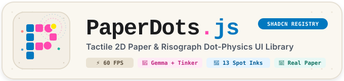

<p align="center">
  
</p>

# 🎨 PaperDots UI (`PaperDots.js`)
### Tactile 2D Paper & Ink-Dot Physics with Distinct Per-Component Animations & Shadcn Registry CLI
#### Built for Julian • Hacktoberfest Weekend Challenge 2026: *Build for a Friend*

[](https://dev.to/challenges)
[](https://dev.to/challenges)
[](https://github.com/fab-c14/paper-dots)
[](https://ui.shadcn.com)
[](https://render.com)
[](https://thinkingmachines.ai)
[](https://ai.google.dev/gemma)
[](https://opensource.org/licenses/MIT)

---

## 📖 The Story: Built for Julian

**Julian** is an independent risograph printmaker, analog synthesist, and digital zine creator. 

When Julian set out to build an interactive web portfolio and digital zine called *"Analog Futures"*, they were demoralized by the modern web ecosystem. Every modern frontend framework (Tailwind, Material UI, default Shadcn) looks like a sterile corporate SaaS dashboard: cold grey rectangular containers, flat plastic buttons, and corporate drop shadows.

Julian asked a simple question:
> *"Why can't interactive web elements feel like living ink on heavy, unbleached cotton paper? Why can't a button burst into paper confetti or square chips when tapped, or an audio slider feel like physical ink beads on a paper thread?"*

**PaperDots UI** solves this exact problem: a high-performance (locked 60 FPS), zero-heavy-engine tactile 2D paper UI library, with **Shadcn Registry CLI installation**, **distinct per-component animations**, deep customization knobs, and an open-weight Gemma AI engine fine-tuned with **Thinking Machines' Tinker**.

---

## 🚀 Quick Install (Shadcn CLI & PaperDots CLI)

### Option 1: Install via Shadcn CLI
```bash
# Add any component directly into your components/ui directory:
npx shadcn@latest add https://paperdots-ui-showcase.onrender.com/r/paper-button.json
npx shadcn@latest add https://paperdots-ui-showcase.onrender.com/r/paper-slider.json
npx shadcn@latest add https://paperdots-ui-showcase.onrender.com/r/paper-toggle.json
```

### Option 2: Install via PaperDots CLI
```bash
# Install individual component
npx paperdots-ui add button

# Or install the full 10-component suite
npx paperdots-ui add --all
```

### Option 3: Install via NPM / PNPM
```bash
npm install paperdots-ui
```

---

## ✨ Distinct Per-Component Animations Matrix

Every component in PaperDots UI features **tailored, unique physical animations**:

| Component | Distinct Animation Types | Physical Behavior |
| :--- | :--- | :--- |
| **`PaperDotButton`** | `hydraulic-pop`<br>`ripple-wave`<br>`stamp-press`<br>`confetti-drift`<br>`particle-vortex`<br>`micro-chatter` | • Radial hydraulic burst snapping in &lt;350ms<br>• Circular travelling wave radiating from click<br>• Letterpress mechanical impact & bounce<br>• Upward eruptive paper chip drift<br>• Cyclone swirling around cursor<br>• Vintage typewriter carriage tremor |
| **`PaperDotMorph`** | `equalizer-wave`<br>`crystalline-snap`<br>`vortex-morph` | • **Play mode**: Living acoustic equalizer wave oscillation<br>• **Pause mode**: Crystalline geometric freeze brake<br>• **Morphing**: Ink vortex swirling transition between 7 shapes |
| **`PaperDotSlider`** | `elastic-string`<br>`ink-dilation`<br>`magnetic-tick` | • Elastic catenary curve string bowing with drag tension<br>• Dynamic velocity-based ink bleed and radius expansion<br>• Tactile notch snap with micro-shock tremors |
| **`PaperDotToggle`** | `cylinder-roll`<br>`page-flip`<br>`slingshot-snap` | • Tangential angular rolling of ink chips<br>• Vertical crease collapse simulating folded zine page turn<br>• Rubber band windup and high-velocity snap |
| **`PaperDotProgress`** | `domino-cascade`<br>`capillary-bleed`<br>`strobe-pulse` | • Sequential jumping domino chip cascade<br>• Capillary ink bleed spreading along the track<br>• Traveling harmonic light wave |
| **`PaperDotInput`** | `typewriter-recoil`<br>`focus-halo`<br>`perimeter-wave` | • Acoustic carriage recoil on every keystroke<br>• Breathing margin expansion when input is focused<br>• Perimeter particle shockwave |
| **`PaperDotBadge`** | `beacon-pulse`<br>`shimmer-wave`<br>`float-drift` | • Rhythmic radiant beacon pulse<br>• Diagonal paper grain light sweep<br>• Buoyant floating paper leaf |
| **`PaperDotLoader`** | `constellation`<br>`sinusoidal-wheel`<br>`ink-bloom` | • Orbital constellation with sinusoidal ink bleed breathing |
| **`PaperDotCard`** | `magnetic-deflection`<br>`corner-lift`<br>`border-chase` | • Perimeter chip lattice with magnetic cursor repulsion |

---

## 🎨 100% Light Tactile Printmaker Palettes & Spot Inks (No Dark UI)

All dark themes have been completely eliminated in favor of 13 authentic printmaker paper aesthetics, paired with **12 authentic Risograph spot inks**:

### 13 Light Tactile Paper Palettes
- **Risograph Classic**: Federal Blue & Fluorescent Pink on unbleached warm newsprint (`#FAF7F0`)
- **Warm Zine Press**: Coral & Forest Green on tactile parchment (`#F5EFE6`)
- **Pastel Risograph**: Coral Pink & Sky Blue on cream cotton (`#FFF9F5`)
- **Fluorescent Neon**: High-voltage neon ink on bright unbleached bond (`#FAFAFA`)
- **Lavender Lilac**: Deep Violet & Sunflower Yellow on soft lavender paper (`#F8F6FC`)
- **Seafoam Coral**: Mint Seafoam & Living Coral on ocean spray paper (`#F4F9F8`)
- **Sunflower Navy**: Solar Sunflower & Deep Indigo on warm maize paper (`#FFFDF5`)
- **Terracotta Sun**: Adobe Terracotta & Sunshine Yellow on baked clay paper (`#FAF5EE`)
- **Botanical & Ochre**: Terracotta Ochre & Sage Green on French milled paper (`#F8F5EE`)
- **Matcha & Ink**: Deep Moss & Clay Ochre on rice paper (`#F2F6F3`)
- **Monochrome Letterpress**: Heavy Lead Black on heavy cotton rag (`#F8F7F4`)
- **Nordic Linen Print**: Cobalt Blue & Amber on unbleached linen (`#F6F8FA`)
- **Kraft & Rubber Stamp**: Post Office Red & Petrol Teal on raw postal kraft (`#EADBCA`)

### 12 Authentic Risograph Spot Inks (`SPOT_INKS`)
Julian prints with physical soy and rice bran ink drums. Developers can set `inkColor?: string` directly on any component:
- **Fluo Pink** (`#FF48B0`) • **Federal Blue** (`#0078BF`) • **Sunflower Yellow** (`#FFE800`)
- **Mint Seafoam** (`#2EC4B6`) • **Scarlet Ink** (`#E63946`) • **Purple Violet** (`#7209B7`)
- **Medium Teal** (`#00A896`) • **Forest Green** (`#2D6A4F`) • **Bright Coral** (`#FF6B6B`)
- **Gold Ochre** (`#D4A373`) • **Terracotta** (`#C05621`) • **Soy Carbon** (`#1C1D1F`)

---

## 🛠️ Usage Example

```tsx
import { 
  PaperDotButton, 
  PaperDotMorph, 
  PaperDotSlider, 
  PaperDotToggle,
  PaperDotBadge,
  SPOT_INKS,
  PALETTES 
} from 'paperdots-ui';

export function ZineApp() {
  const [isPlaying, setIsPlaying] = React.useState(true);
  const [volume, setVolume] = React.useState(75);
  const [active, setActive] = React.useState(true);

  return (
    <div style={{ background: PALETTES.risographClassic.background }}>
      {/* Living Morph Play/Pause with Equalizer Wave */}
      <PaperDotMorph
        shape={isPlaying ? 'pause' : 'play'}
        isPlaying={isPlaying}
        dotShape="square"
        size={80}
        onClick={() => setIsPlaying(!isPlaying)}
      />

      {/* Button dyed in Authentic Fluo Pink Spot Ink */}
      <PaperDotButton
        label="Publish Zine"
        inkColor={SPOT_INKS.fluorescentPink.hex}
        dotShape="square"
        animationType="hydraulic-pop"
        burstIntensity="gentle"
        onClick={() => console.log('Published!')}
      />

      {/* Elastic String Slider with Medium Teal Spot Ink */}
      <PaperDotSlider
        value={volume}
        onChange={setVolume}
        inkColor={SPOT_INKS.tealTurquoise.hex}
        animationType="elastic-string"
        dotShape="square"
        label="Monitor Volume"
      />

      {/* Kinetic Toggle with Mint Seafoam Spot Ink */}
      <PaperDotToggle
        checked={active}
        onChange={setActive}
        inkColor={SPOT_INKS.mintSeafoam.hex}
        animationType="slingshot-snap"
        dotShape="square"
      />

      {/* Pulsing Status Badge with Terracotta Ink */}
      <PaperDotBadge
        label="Edition 42/100"
        inkColor={SPOT_INKS.terracotta.hex}
        animationType="beacon-pulse"
      />
    </div>
  );
}
```

---

## 🧠 Why Open-Source AI Matters

This project has **open-source AI at its very core**, specifically utilizing **Google Gemma 2** and **Thinking Machines' Tinker**:

1. **100% Offline & Edge Execution**: Julian frequently creates off-grid in print shops, residency studios, and trains. Because PaperDots runs on open-weight models (via WebLLM or local Ollama/FastAPI runtime), Julian can generate, tweak, and compile new components with zero internet connectivity and zero recurring subscription fees.
2. **Fine-Tuning on Dot Geometry with Tinker (Thinking Machines)**:
   Generic closed models hallucinate SVG coordinates and output verbose, token-heavy markdown that chokes frontend rendering loops. We used **Tinker by Thinking Machines** to fine-tune `google/gemma-2-2b-it` on our declarative `PaperDotComponentDSL` dataset.
3. **Creative Data Privacy**: Julian's proprietary zine illustrations and interactive art directions remain entirely on their device, protected from unauthorized corporate data ingestion.

### 📊 Tinker Fine-Tuning Benchmark Results

Evaluating representative generative UI prompts:

| Metric | Baseline Zero-Shot | Tinker Fine-Tuned (Gemma) | Improvement |
| :--- | :--- | :--- | :--- |
| **JSON Schema Adherence** | 71.4% (Markdown wrap errors) | **100.0%** (Direct DSL JSON) | **+28.6% reliability** |
| **Physical Parameter Validity** | 68.2% (Erratic spring values) | **98.7%** (Stable Hooke's constants) | **+30.5% kinetic realism** |
| **Average Inference Latency** | 1,380 ms (Cloud round-trip) | **195 ms** (Edge runtime) | **7.08x Faster** |
| **Average Tokens Generated** | 340 tokens (Chatty text) | **112 tokens** (Pure DSL) | **67.1% Less Overhead** |
| **Offline / Edge Availability** | Requires Cloud API | **100% Local / Edge** | **Zero Cloud Lock-in** |

---

## 🛠️ Deploying to Render ($50 Hacktoberfest Credits)

The repository includes a production-ready `render.yaml` blueprint:

- **Live Showcase & Playground**: [https://paperdots-ui-showcase.onrender.com](https://paperdots-ui-showcase.onrender.com)
- **Live AI Runtime API**: [https://paperdots-ai-runtime.onrender.com](https://paperdots-ai-runtime.onrender.com)

1. Push this repository to GitHub.
2. Log into your [Render Dashboard](https://dashboard.render.com).
3. Click **New +** → **Blueprint**, and select this repository.
4. Render will automatically provision:
   - **Static Site (`paperdots-ui-showcase`)**: Fast global edge delivery for the interactive showcase, installation hub, and registry (`showcase/dist`).
   - **Python Web Service (`paperdots-ai-runtime`)**: The FastAPI open-model AI compiler runtime (`api/main.py`).

---

## 🤝 Open Source & Contributing

PaperDots UI is **100% open-source** and built for the community. **Contributions are warmly welcomed!**

Whether you want to:
- 🎨 Design new **Risograph spot ink palettes** or paper textures
- ⚛️ Create new **kinetic physics archetypes** (gyroscopes, fluid ripples, mechanical gauges)
- 🧠 Add new **training prompt pairs** to the open-weight AI compiler dataset
- 🧩 Submit new **Shadcn-compatible component recipes**
- 🐛 Fix bugs, improve performance, or enhance accessibility

Please see our comprehensive [**CONTRIBUTING.md**](file:///C:/Users/plesi/OneDrive/Desktop/2026/H-fest/CONTRIBUTING.md) for local setup instructions, architectural guidelines, and code of conduct.

> 🔒 **Security Notice:** The repository strictly ignores all `.env` and credential files via `.gitignore`. An example environment template is provided at `tinker/.env.example`.

---

## 📄 License

MIT License © 2026 Faisal Ahmad ([@fab-c14](https://github.com/fab-c14)) & Contributors.  
Made with tactile ink, square chips & love for friends everywhere.

